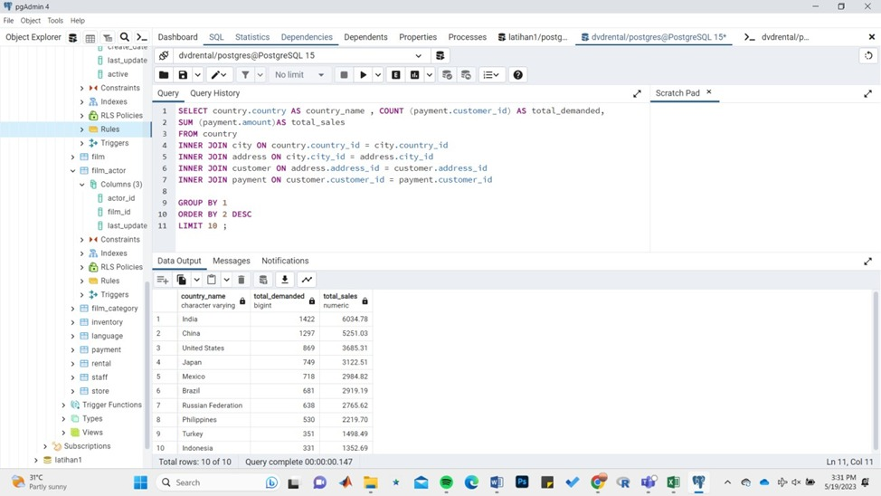

# Portofolio
---

## Lookers Studio Project
Global Covid-19 Cases Dashboard

[[View In Looker Studio]](https://lookerstudio.google.com/reporting/5b9e5197-65c9-486c-bed7-6e85192987fd)

 a COVID-19 dashboard in Looker Studio would serve as a central hub for monitoring and analyzing the pandemic's impact. By presenting data in an intuitive and visually appealing manner, it would enable users to make informed decisions, track trends, and understand the evolving situation more effectively. 
  

## SQL Project
Data: DVD Rental

The DVD rental dataset typically consists of various tables representing different entities such as customers, films, rentals, and payments. SQL allows users to perform a wide range of operations on this dataset, including retrieving specific data, filtering records based on conditions, aggregating information, and performing complex joins between tables. By using PostrageSQL, several variables will be searched as follows: 
1. The top 10 customers and their email so we can reward them. 
2. The bottom 10 customers and their emails. 
3. The most profitable movie genres (ratings). 
4. The number of movies were returned late, early, and on time. 
5. The customer base in the countries where we have a presence. 
6. The most profitable country for the business. 
7. The average rental rate per film genre (rating).

 

 

## Python Project
### DataFrame Basics and Data Cleansing (Data: Telco Customer Churn)

Data cleansing also reffered to as data cleaning is the process of fixing incorrect, incomplete, duplicate or otherwise erroneous data in data set. It involves identifying data errors and then changing, updating or removing data to correct them. In this case, Telco Customer Churn data also need to be cleaned in order to improves the data quality and helps provide more accurate, consistent and reliable information. Data cleaning in the dataset has been carried out with the aim of:  
1. Missing value checking and handling  
2. Categorical data encoding  
3. Outlier handling  
  

### Data Preprocessing with Pandas 

 Data manipulation is a crucial step in data analysis and preparation. It involves transforming and modifying raw data to make it more suitable for analysis or to derive meaningful insights. Data manipulation allows us to clean, filter, reshape, combine, or summarize data based on specific requirements. In this project, data preprocessing is done using the join, merge, delete, rename, group by, and aggregation function. 

### Data Visualization (Data : Titanic)

 Data Visualization is the graphical representation of information and data by using visual elements like charts,graphs,maps,etc. In this case, i used Titanic dataset to visualize the information contained in it. By visually representing the data, we can identify trends, patterns, and correlations that might not be immediately apparent in the raw dataset. These visualizations aid in storytelling, exploration, and the communication of insights derived from the Titanic dataset. In this project, visualization is carried out as follows:  
1. Barplot: plot of the number of passengers based passangers' class, survived category, gender, and embarked. 
2. Boxplot and distplot: distribution plot of passangers' age, passangers' fare, and passangers' siblings/spouses aboard. 
3. Scatterplot: plot of the relationship between passengers' parch and survived category, passangers' siblings/spouses aboard and survived category. 
4. Pie chart: number of passengers based on survived, passangers' class, embarked, and gender.  

### Statistics (Data : Diabetes Patients)

 Statistics is important in data science. Almost all data processing uses statistics in it. This google colaboratory contains the basic and essential part of statistics and the diabetes dataset contains information about patients with diabetes, including clinical measurements such as glucose levels, blood pressure, body mass index (BMI), and diabetes progression over time. Several things are done statistically with this dataset, including: 
1. Descriptive statistics: mean, median, mode, variance. 
2. Boxplot to find out the distribution of data and the number of outliers. 
3. distribution plot to determine the distribution of a variable and the distribution of the data.  

### Exploratory Data Analysis (Data : Telco Customer Churn)

 Exploratory Data Analysis (EDA) is a crucial step in understanding and gaining insights from datasets, and the Telco Customer Churn dataset is often used for exploring customer behavior and identifying factors that contribute to customer churn. Exploratory Data Analysis and Visualization are carried out to find out:  
1. Statistical Summary: numerical and categorical approach.  
2. Univariate Analysis: to find out the distribution of data on numerical data and the number of categorical variables. 
3. Bivariate Analysis: to determine the relationship between 2 variables. 
4. Multivariate Analysis: To determine the correlation between data with a large number of variables using a heatmap.    

### Statistical Modelling (Data : House Prices & Mall Customers)

The House Prices dataset contains information about residential properties, including features like the number of bedrooms, square footage, location, and sale prices. Statistical modeling using regression aims to build a model that predicts housing prices based on these variables and provides insights into the factors driving price variations. Regression modeling allows for understanding the relationships between features and prices, enabling informed decision-making and analysis in the real estate domain.    

The Mall Customers dataset contains information about customers' attributes, such as their age, annual income, and spending score. Statistical modeling using clustering aims to group customers based on similar characteristics and behavior patterns. This allows businesses to better understand their customer base and tailor marketing strategies accordingly. By applying statistical modeling clustering techniques to the Mall Customers dataset, businesses can gain insights into the different customer segments and develop targeted marketing approaches. Clustering also enables businesses to understand their customer base more effectively for improved decision-making and customer-centric strategies.  

