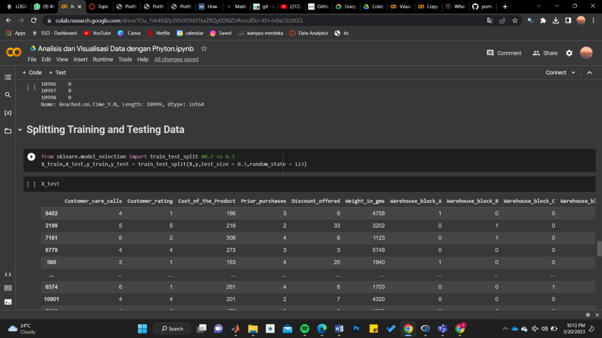

# Portofolio
---

##Topik 18
## DataFrame Basics and Data Cleansing (Data: Telco Customer Churn)
[![View In Google Data Studio]](https://lookerstudio.google.com/reporting/5b9e5197-65c9-486c-bed7-6e85192987fd)

Data cleansing also reffered to as data cleaning is the process of fixing incorrect, incomplete, duplicate or otherwise erroneous data in data set. It involves identifying data errors and then changing, updating or removing data to correct them. In this case, Telco Customer Churn data also need to be cleaned in order to improves the data quality and helps provide more accurate, consistent and reliable information.   

##Topik 5
## DataFrame Basics and Data Cleansing (Data: Telco Customer Churn)

Data cleansing also reffered to as data cleaning is the process of fixing incorrect, incomplete, duplicate or otherwise erroneous data in data set. It involves identifying data errors and then changing, updating or removing data to correct them. In this case, Telco Customer Churn data also need to be cleaned in order to improves the data quality and helps provide more accurate, consistent and reliable information.   

##Topik 6
## Data Manipulation with Pandas 

 Data Manipulation is the process of manipulating or changing information to make the data more organized and easier to read. So the data will be easier to interpret. 

##Topik 78
## Data Visualization (Data : Titanic)

 Data Visualization is the graphical representation of information and data by using visual elements like charts,graphs,maps,etc. Data visualization tools provide an accessible way to see and understand trends, outliers, and patterns in data. In this case, i used Titanic dataset to visualize the information contained in it.  

##Topik 910
## Statistics (Data : Diabetes Patients)

 Statistics is important in data science. Almost all data processing uses statistics in it. This google colaboratory contains the basic and essential part of statistics  

##Topik 1112 
## Exploratory Data Analysis (Data : Telco Customer Churn)

 Statistics is important in data science. Almost all data processing uses statistics in it. This google colaboratory contains the basic and essential part of statistics  

##Topik 1314 
## Statistical Modelling (Data : House Prices & Mall Customers)

 Statistics is important in data science. Almost all data processing uses statistics in it. This google colaboratory contains the basic and essential part of statistics  

## Data Analysis and Visualization (Data: Museum Visitors Data)

Data analysis is the process of bringing order structure to collected data. It turns data into information teams can use and data visualization is the graphical representation of information and data. By using visual elements like charts, graphs, and maps, data visualization tools provide an accessible way to see and understand trends, outliers, and patterns in data. Additionally, it provides an excellent way for employees or business owners to present data to non-technical audiences without confusion. In the world of Big Data, data visualization tools and technologies are essential to analyze massive amounts of information and make data-driven decisions. 

