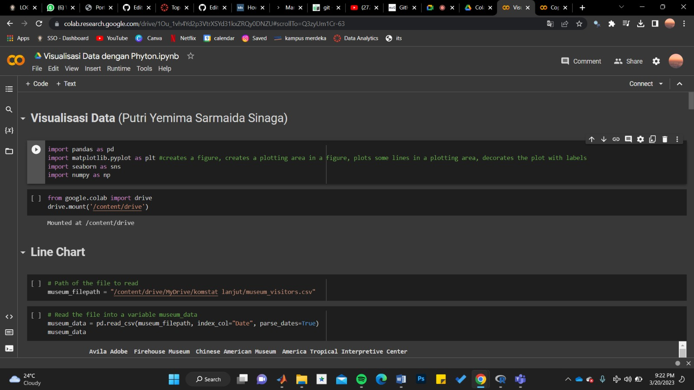

# Portofolio
---
## Data Visualizations (Data: Museum Visitors Data)

Data visualization is the graphical representation of information and data. By using visual elements like charts, graphs, and maps, data visualization tools provide an accessible way to see and understand trends, outliers, and patterns in data. Additionally, it provides an excellent way for employees or business owners to present data to non-technical audiences without confusion.

In the world of Big Data, data visualization tools and technologies are essential to analyze massive amounts of information and make data-driven decisions. 

