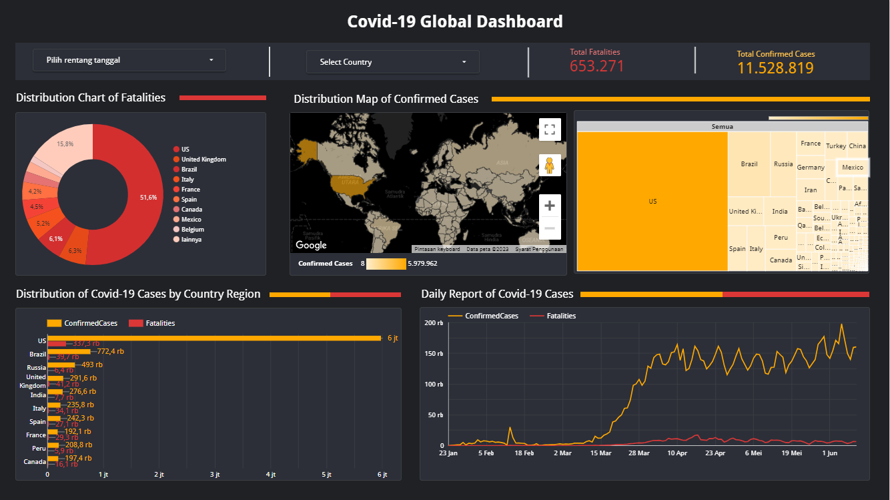
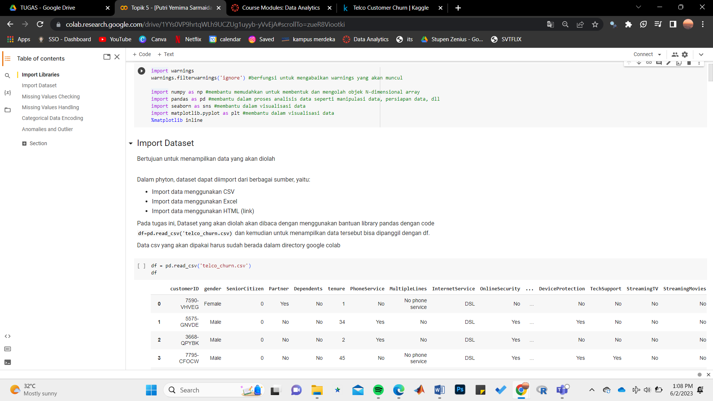
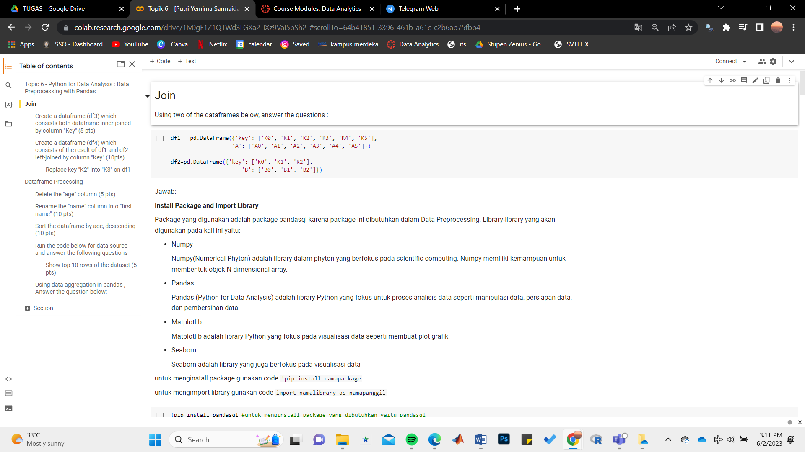
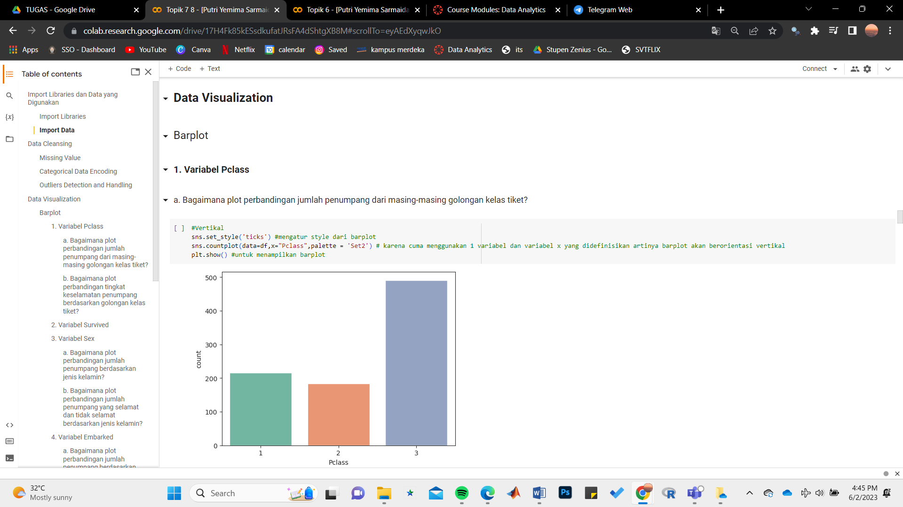
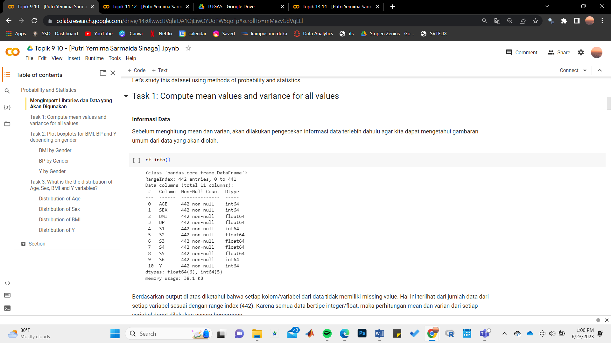
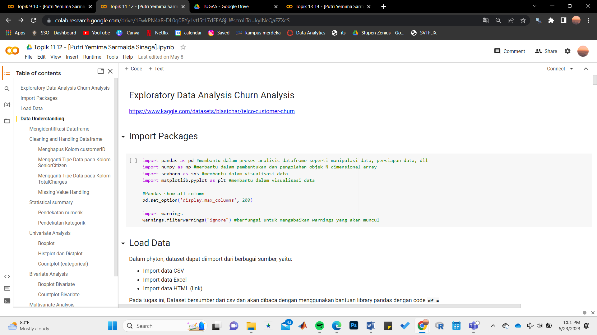
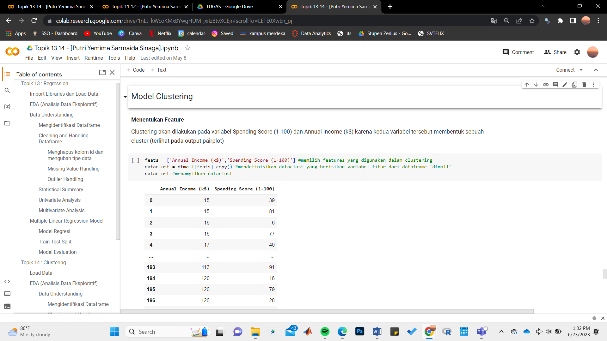

# Portofolio
---

## Data Visualization Project with Looker Studio
Global Covid-19 Cases Dashboard

[[View In Looker Studio]](https://lookerstudio.google.com/reporting/5b9e5197-65c9-486c-bed7-6e85192987fd)

 a COVID-19 dashboard in Looker Studio would serve as a central hub for monitoring and analyzing the pandemic's impact. By presenting data in an intuitive and visually appealing manner, it would enable users to make informed decisions, track trends, and understand the evolving situation more effectively.   

## DataFrame Basics and Data Cleansing (Data: Telco Customer Churn)

Data cleansing also reffered to as data cleaning is the process of fixing incorrect, incomplete, duplicate or otherwise erroneous data in data set. It involves identifying data errors and then changing, updating or removing data to correct them. In this case, Telco Customer Churn data also need to be cleaned in order to improves the data quality and helps provide more accurate, consistent and reliable information.   

## Data Manipulation with Pandas 

 Data manipulation is a crucial step in data analysis and preparation. It involves transforming and modifying raw data to make it more suitable for analysis or to derive meaningful insights. Data manipulation allows us to clean, filter, reshape, combine, or summarize data based on specific requirements. Data manipulation functions in Pandas offer a wide range of capabilities to clean, transform, and analyze data. The library offers a vast array of functions and methods that cater to various data manipulation needs, making it a powerful tool for working with structured data in Python. 

## Data Visualization (Data : Titanic)

 Data Visualization is the graphical representation of information and data by using visual elements like charts,graphs,maps,etc. Data visualization tools provide an accessible way to see and understand trends, outliers, and patterns in data. In this case, i used Titanic dataset to visualize the information contained in it. Data visualization with the Titanic dataset helps us understand the dynamics of the tragic event and sheds light on factors that influenced survival. By visually representing the data, we can identify trends, patterns, and correlations that might not be immediately apparent in the raw dataset. These visualizations aid in storytelling, exploration, and the communication of insights derived from the Titanic dataset.  

## Statistics (Data : Diabetes Patients)

 Statistics is important in data science. Almost all data processing uses statistics in it. This google colaboratory contains the basic and essential part of statistics and the diabetes dataset contains information about patients with diabetes, including clinical measurements such as glucose levels, blood pressure, body mass index (BMI), and diabetes progression over time. By applying statistical analysis to this dataset, we can gain insights into the relationship between these variables, identify risk factors, and many more.   

## Exploratory Data Analysis (Data : Telco Customer Churn)

 Exploratory Data Analysis (EDA) is a crucial step in understanding and gaining insights from datasets, and the Telco Customer Churn dataset is often used for exploring customer behavior and identifying factors that contribute to customer churn. The Telco Customer Churn dataset contains information about customers of a telecommunications company, including features such as customer demographics, services subscribed, contract details, and churn status (whether a customer has churned or not). By performing exploratory data analysis on this dataset, we can uncover patterns, relationships, and potential predictors of customer churn. We also can gain valuable insights to inform business decisions and develop effective churn prevention strategies  

## Statistical Modelling (Data : House Prices & Mall Customers)

 The House Prices dataset contains information about residential properties, including features like the number of bedrooms, square footage, location, and sale prices. Statistical modeling using regression aims to build a model that predicts housing prices based on these variables and provides insights into the factors driving price variations. Regression modeling allows for understanding the relationships between features and prices, enabling informed decision-making and analysis in the real estate domain.
  
The Mall Customers dataset contains information about customers' attributes, such as their age, annual income, and spending score. Statistical modeling using clustering aims to group customers based on similar characteristics and behavior patterns. This allows businesses to better understand their customer base and tailor marketing strategies accordingly. By applying statistical modeling clustering techniques to the Mall Customers dataset, businesses can gain insights into the different customer segments and develop targeted marketing approaches. Clustering also enables businesses to understand their customer base more effectively for improved decision-making and customer-centric strategies.

 

